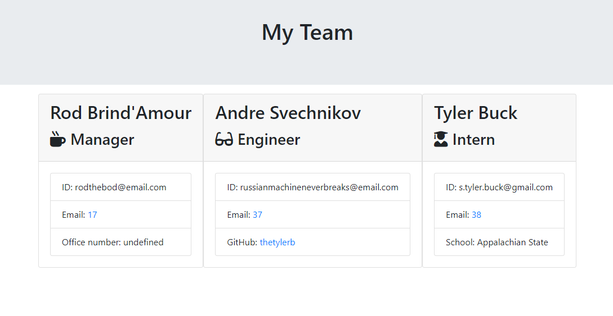
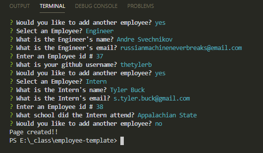

# employee-template

## Create and use a CLI to create the HTML!

## Table of Contents
1. Description
2. Technologies Used
3. Installation
4. Usage
5. Contributors
6. Questions
7. Credits

## Description

## Technologies Used
* inquirer
* jest
* JavaScript
* Node.js
* HTML

## Installation
1. Clone the respository from GitHub
2. Naviagate to the project directory, then run npm install to install dependencies for the project

## Usage
1. node index.js
2. Answer the questions. Continue to add as many employees as you'd like
3. A team.html file will be created in the output folder in your directory. View that file in your browser to see a visualization of your team members.

## Contributors
1. Tyler Buck
2. Class Files

## Questions
1. How can I make the final product look better?
2. How can I route it to update the readME instead of having to manually re-enter the photo

## Credits 
1. Inquirer.js documentation: https://www.npmjs.com/package/inquirer